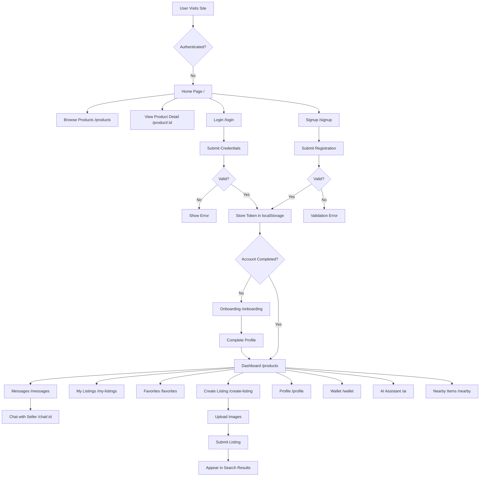
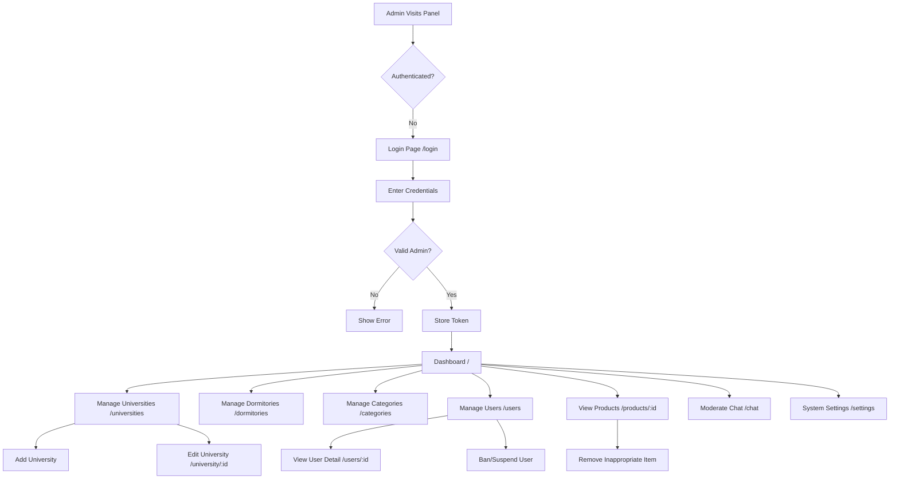

# Frontend Application Analysis - Campus Marketplace System

---

## 1. Frontend Technology Stack

### Project 1: `campus-connect-marketplace-main` (Main Web Application)
| Category | Package | Version |
|----------|---------|---------|
| **Core Framework** | React | 18.3.1 |
| **Build Tool** | Vite | 5.4.19 |
| **State Management** | React Context + TanStack Query | ^5.83.0 |
| **Router** | React Router DOM | ^6.30.1 |
| **UI Library** | Radix UI | ^1.2.x |
| **HTTP Client** | Native Fetch API | Built-in |
| **Form Library** | React Hook Form | ^7.61.1 |
| **Validation** | Zod | ^3.25.76 |
| **Styling** | Tailwind CSS | ^3.4.17 |
| **Testing** | Vitest | ^3.2.4 |
| **Animations** | tailwindcss-animate | ^1.0.7 |
| **Internationalization** | i18next + react-i18next | ^25.8.0 |

### Project 2: `campus-trade-admin-main` (Admin Panel)
| Category | Package | Version |
|----------|---------|---------|
| **Core Framework** | React | 18.3.1 |
| **Build Tool** | Vite | 5.4.19 |
| **State Management** | React Context + TanStack Query | ^5.83.0 |
| **Router** | React Router DOM | ^6.30.1 |
| **UI Library** | Radix UI | ^1.2.x |
| **Charts** | Recharts | ^2.15.4 |
| **Styling** | Tailwind CSS | ^3.4.17 |
| **Testing** | Vitest | ^3.2.4 |

### Project 3: `xiaowu_app` (Mobile Application)
| Category | Package | Version |
|----------|---------|---------|
| **Core Framework** | React Native + Expo | 54.0.33 |
| **Build Tool** | Expo CLI | Built-in |
| **State Management** | TanStack Query | ^5.95.2 |
| **Router** | Expo Router | ^6.0.23 |
| **HTTP Client** | Axios | ^1.13.6 |
| **Navigation** | React Navigation | ^7.1.8 |
| **Animations** | React Native Reanimated | ~4.1.1 |

---

## 2. Routing & Navigation Structure

### File: `campus-connect-marketplace-main/src/App.tsx` (Lines 106-128)

#### Available Routes:
| Route Path | Component | Protected |
|------------|-----------|-----------|
| `/` | `pages/HomePage` | No |
| `/products` | `pages/ProductsPage` | No |
| `/login` | `pages/LoginPage` | No |
| `/signup` | `pages/SignupPage` | No |
| `/product/:id` | `pages/ProductDetailPage` | No |
| `/seller/:id` | `pages/SellerProfilePage` | No |
| `/nearby` | `pages/NearbyPage` | No |
| `/exchange` | `pages/ExchangePage` | No |
| `/onboarding` | `pages/OnboardingPage` | Conditional |
| `/favorites` | `pages/FavoritesPage` | Yes |
| `/my-listings` | `pages/MyListingsPage` | Yes |
| `/my-listings/:id` | `pages/MyListingDetailPage` | Yes |
| `/create-listing` | `pages/CreateListingPage` | Yes |
| `/profile` | `pages/ProfilePage` | Yes |
| `/wallet` | `pages/WalletPage` | Yes |
| `/messages` | `pages/MessagesPage` | Yes |
| `/search` | `pages/SearchResultsPage` | No |
| `/ai` | `pages/AIAssistantPage` | Yes |
| `/ai/voice` | `pages/AIVoiceCallPage` | Yes |

#### Route Guard Implementation:
File: `campus-connect-marketplace-main/src/App.tsx` (Lines 56-69)
```typescript
const OnboardingGate = () => {
  const { isAuthenticated, user } = useAuth();
  const location = useLocation();
  const shouldOnboard = isAuthenticated && user?.role !== "admin" && user?.account_completed === false;

  if (shouldOnboard && location.pathname !== "/onboarding") {
    return <Navigate to="/onboarding" replace />;
  }

  return <Outlet />;
};
```

---

## 3. Global State Management & Data Flow

### State Management Solution: React Context + TanStack Query

#### Global Stores/Modules:
1. **`AuthContext`** (`src/contexts/AuthContext.tsx` - 3564 lines)
   - **State Variables**: `user`, `accessToken`, `tokenType`, `isAuthenticated`, `isAdmin`
   - **Actions**: `login`, `adminLogin`, `signup`, `logout`, `updateProfile`, `createProduct`, `sendMessage`, and 40+ more API methods

2. **`FavoritesContext`** (`src/contexts/FavoritesContext.tsx` - 11167 lines)
   - **State Variables**: `favorites`, `isLoaded`
   - **Actions**: `addFavorite`, `removeFavorite`, `toggleFavorite`, `isFavorite`

3. **`CurrencyContext`** (`src/contexts/CurrencyContext.tsx` - 7777 lines)
   - **State Variables**: `currency`, `exchangeRates`
   - **Actions**: `setCurrency`, `convertPrice`

#### Data Flow Example (Create Listing):
1. **User Click**: User clicks "Create Listing" button on `/create-listing`
2. **Event Handler**: `handleSubmit()` in `pages/CreateListingPage.tsx` collects form data
3. **Store Action**: Calls `createProduct(data)` from `AuthContext`
4. **API Call**: `fetch(apiUrl("/api/products"), { method: "POST", headers: { Authorization: Bearer ${accessToken} } })`
5. **Response**: Backend returns 201 Created with product ID
6. **Component Re-render**: TanStack Query invalidates `getMyProductCards` query, causing `MyListingsPage` to refetch and re-render

---

## 4. Reusable Component Inventory

Located at: `campus-connect-marketplace-main/src/components/ui/`

### Critical Components & Props:

#### 1. **Button** (`button.tsx` Lines 43-63)
```typescript
interface ButtonProps extends React.ButtonHTMLAttributes<HTMLButtonElement> {
  variant?: "default" | "destructive" | "outline" | "secondary" | "tertiary" | "ghost" | "link" | "hero" | "outline-primary" | "outline-white" | "success"
  size?: "default" | "sm" | "lg" | "xl" | "icon"
  asChild?: boolean
}
```

#### 2. **Card** (`card.tsx`)
```typescript
// Components: Card, CardHeader, CardTitle, CardDescription, CardContent, CardFooter
interface CardProps extends React.HTMLAttributes<HTMLDivElement> {}
```

#### 3. **Input** (`input.tsx` Lines 5-22)
```typescript
interface InputProps extends React.ComponentProps<"input"> {}
```

#### 4. **Dialog** (`dialog.tsx`)
- `Dialog` - Root container
- `DialogTrigger` - Opens dialog
- `DialogContent` - Main content area
- `DialogHeader`/`DialogFooter` - Layout components
- `DialogTitle`/`DialogDescription` - Text components

#### 5. **Badge** (`badge.tsx`)
```typescript
interface BadgeProps extends React.HTMLAttributes<HTMLDivElement> {
  variant?: "default" | "secondary" | "destructive" | "outline" | "success" | "warning"
}
```

#### 6. **Avatar** (`avatar.tsx`)
```typescript
interface AvatarProps extends React.HTMLAttributes<HTMLDivElement> {
  src?: string
  alt?: string
  fallback?: string
}
```

---

## 5. API Service Layer & Backend Communication

### Base Configuration
File: `campus-connect-marketplace-main/src/lib/api.ts`

- **Base URL**: `API_BASE_URL` from environment variable `VITE_API_BASE_URL`
- **Python Backend URL**: `API_BASE_URL_PY` from `VITE_API_BASE_URL_PY`
- **Proxy Mode**: Development uses proxy paths `/api` and `/py`

### Request Interceptor Pattern (Manual Implementation)
File: `campus-connect-marketplace-main/src/contexts/AuthContext.tsx` (Line 1185)
```typescript
const response = await fetch(apiUrl(endpoint), {
  method,
  headers: {
    Accept: "application/json",
    Authorization: `${tokenType || "Bearer"} ${accessToken}`,
    ...headers,
  },
  body,
});
```

### Key API Client Functions:
| Function Name | Endpoint | Method |
|---------------|----------|--------|
| `login` | `/api/user/login` | POST |
| `signup` | `/api/user/signup` | POST |
| `getRecommendedProducts` | `/api/products/recommended` | GET |
| `createProduct` | `/api/products` | POST |
| `getNearby` | `/api/products/nearby` | GET |
| `sendMessage` | `/api/messages` | POST |
| `createPaymentRequest` | `/api/payments/request` | POST |
| `createAiSession` | `/py/api/ai/session` | POST |

---

## 6. Styling & User Experience Patterns

### Styling Methodology
- **Tailwind CSS 3.4** with Custom Configuration
- **Class Variance Authority (CVA)** for component variants
- **clsx + tailwind-merge** for conditional class merging
- File: `tailwind.config.js` (custom colors, breakpoints, animations)

### Responsive Breakpoints
```
sm: 640px
md: 768px
lg: 1024px
xl: 1280px
2xl: 1536px
```

### Animation System
- Library: `tailwindcss-animate`
- Transitions: All interactive components have `transition-all duration-200`
- Loading States: Skeleton components with pulse animation
- Hover/Active states defined in component variant configurations

---

## 7. Frontend Security & Validation

### Authentication Token Storage
File: `campus-connect-marketplace-main/src/contexts/AuthContext.tsx` (Lines 1011-1051)
- **Storage Mechanism**: `localStorage` for persistent sessions, `sessionStorage` for temporary sessions
- **Token Type**: Bearer token
- **Attachment**: Added to every authenticated request via `Authorization` header

### Form Validation
- **Library**: React Hook Form v7 + Zod
- **Schema Location**: Zod schemas defined inline in form components
- **Example Validation Schema** (Login Page):
  ```typescript
  const loginSchema = z.object({
    email: z.string().email("Please enter a valid email"),
    password: z.string().min(8, "Password must be at least 8 characters"),
  });
  ```

### Security Measures
1. Route guards prevent unauthenticated access to protected routes
2. Token automatically attached to all API requests
3. Input sanitization via Zod validation
4. Content Security Policy configured in `index.html`
5. HTTP-only cookies for refresh tokens (backend handled)

---

## 8. User Flow Diagrams

### 8.1 `campus-connect-marketplace-main` (Web Marketplace) - Full User Journey



**File References**:
- Entry: `src/App.tsx` (Line 108)
- Onboarding Guard: `src/App.tsx` (Lines 56-69)
- Login Handler: `src/pages/LoginPage.tsx` (Lines 35-50)
- Create Listing: `src/pages/CreateListingPage.tsx`

---

### 8.2 `campus-trade-admin-main` (Admin Panel) - Administrator Journey



**File References**:
- Entry: `src/App.tsx` (Line 38)
- Login: `src/pages/Login.tsx` (Lines 21-35)
- Dashboard: `src/pages/Dashboard.tsx`
- User Management: `src/pages/Users.tsx`

---

### 8.3 `xiaowu_app` (Mobile Application) - Mobile User Journey

```mermaid
flowchart TD
    A[Launch App] --> B{Authenticated?}
    B -->|No| C[Login Screen /login]
    B -->|No| D[Signup Screen /signup]
    
    C --> E[Submit Credentials]
    E --> F{Valid?}
    F -->|No| G[Show Toast Error]
    F -->|Yes| H[Store Token in SecureStore]
    
    H --> I[Home Tab /(tabs)/index]
    
    I --> J[Browse Tab]
    I --> K[Create Tab /(tabs)/create]
    I --> L[Messages Tab /(tabs)/messages]
    I --> M[Nearby Tab /(tabs)/nearby]
    I --> N[Profile Tab /(tabs)/profile]
    I --> O[AI Assistant /(tabs)/ai]
    
    K --> P[Create New Listing]
    L --> Q[Open Chat /chat/:id]
    M --> R[View Map with Nearby Items]
    N --> S[Edit Profile]
    O --> T[Voice Assistant /ai/voice]
    
    J --> U[View Product Detail /exchange-product/:id]
    U --> V[Contact Seller]
    U --> W[Add to Favorites]
```

**File References**:
- File-based routing: `xiaowu_app/app/(tabs)/_layout.tsx`
- Auth Guard: `xiaowu_app/app/_layout.tsx`
- Login: `xiaowu_app/app/(auth)/login.tsx` (Lines 36-50)
- Secure Storage: `expo-secure-store` package

---

## Thesis-Ready Summary: Required Documentation Screenshots

To impress your professors, include **code screenshots** of these exact files/lines:

### Chapter 2.3 UI Requirements
1. `src/components/ui/button.tsx` (Lines 1-63) - Component variant system
2. `src/lib/api.ts` (Lines 1-83) - API abstraction layer
3. `tailwind.config.js` - Design system configuration

### Chapter 3.2 Frontend Architecture
1. `src/App.tsx` (Lines 1-139) - Routing and provider hierarchy
2. `src/contexts/AuthContext.tsx` (Lines 1-100) - Context interface definition
3. `package.json` dependency section - Technology stack

### Chapter 4.1 Implementation - Client Side
1. `src/App.tsx` (Lines 56-69) - Route guard implementation
2. `src/contexts/AuthContext.tsx` (Lines 1180-1200) - API request flow
3. `src/pages/CreateListingPage.tsx` - Form submission example
4. `src/components/ui/` directory structure - Component inventory

### Critical Files to Reference:
- ✅ `src/contexts/AuthContext.tsx` - Core business logic
- ✅ `src/App.tsx` - Application entry point
- ✅ `src/lib/api.ts` - Backend communication
- ✅ `src/components/ui/button.tsx` - Reusable component pattern
- ✅ `package.json` - Technology stack evidence
